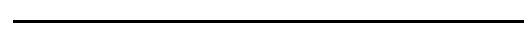

# **Recursion: Koch Curve and Snowflake**

---

### **Background**
You can create intricate line drawings by starting with a simple pattern that is recursively subdivided into parts, each of which is a reduced-size copy of the whole. The results are related to mathematical objects called *fractals*, and images generated in this manner are often called *fractal images*.

One example of a fractal curve is the **Koch curve**, introduced by Swedish mathematician Helge von Koch in 1904. You derive a Koch curve by beginning with a straight line, then dividing it into smaller segments and replacing the middle segment with two lines that form an equilateral triangle (excluding the base). At each subsequent step, replace each line segment with a smaller copy of the same pattern. The process continues recursively.



When this pattern is repeated enough times, the Koch curve displays intricate beauty. An even more remarkable figure can be created by joining three Koch curves as if they were the sides of a triangle. This figure is often referred to as the **Koch snowflake**.


---
### **Instructions**

#### **Part 1: Koch Curve**
1. Implement a method `drawKochCurve(int level, double length)` that:
   - Uses recursion to break the line into smaller segments.
   - Draws each segment, turning the drawing tool appropriately to create the triangular "bump."
   - Reduces the length of each segment with each recursive call.

   *Hint*: At each recursion level, you will draw four smaller Koch curves that replace the current line segment. Use angles of 60 and 120 degrees to achieve the correct shape.

Sample usage to draw a level-6 Koch curve of length 300:
```java
KochCurve curve = new KochCurve();
curve.drawKochCurve(6, 300);
```

#### **Part 2: Koch Snowflake**
1. Extend the **KochCurve** program to include a method `drawKochSnowflake(int level, double length)`.
2. This method should:
   - Draw three Koch curves, each rotated by 120 degrees to form an equilateral triangle.
   - Ensure the snowflake starts and ends at the same point to create a closed shape.

#### **Part 3: Submission**
1. Submit the source code for your program.
2. Provide screenshots of the outputs:
   - A Koch curve at multiple levels (e.g., levels 3, 4, and 6).
   - A Koch snowflake at level 4.

---

### **Bonus Challenge**
1. Add a graphical user interface (GUI) that allows users to:
   - Enter the desired recursion level and initial length.
   - Click a button to draw the Koch curve or snowflake.

2. Experiment with adding colors that change at each level of recursion to enhance the visual appeal of the fractals.


---

### **Example Output**
- **Koch Curve** (Level 4): A detailed fractal line.
- **Koch Snowflake** (Level 4): A snowflake-like figure formed by three Koch curves.


