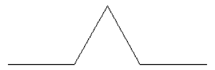
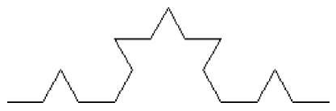
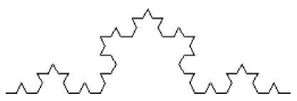
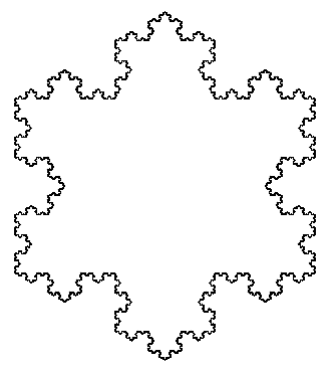

# **Recursion: Koch Curve and Snowflake**

---

### **Background**
You can create intricate line drawings by starting with a simple pattern that is recursively subdivided into parts, each of which is a reduced-size copy of the whole. The results are related to mathematical objects called *fractals*, and images generated in this manner are often called *fractal images*.

One example of a fractal curve is the **Koch curve**, introduced by Swedish mathematician Helge von Koch in 1904. You derive a Koch curve by beginning with the following basic four-segment piece:

1. Start with a straight line.
2. Divide the line into three equal segments.
3. Replace the middle segment with two lines that form an equilateral triangle (excluding the base).



At each subsequent step, replace each line segment with a smaller copy of the same pattern. The process continues recursively.





When this pattern is repeated enough times, the Koch curve displays intricate beauty. An even more remarkable figure can be created by joining three Koch curves as if they were the sides of a triangle. This figure is often referred to as the **Koch snowflake**.


---

### **Objective**
Your goal is to implement a program in Java that:
1. Draws the Koch curve recursively.
2. Combines three Koch curves to create a Koch snowflake.

---

### **Pseudocode for Koch Curve**
The procedure for creating a Koch curve is recursive and can be described with the following pseudocode:

```
if level < 1 then
    Move forward length pixels
else
    Draw a (level - 1) Koch curve with segments 1/3 the current length
    Turn left 60 degrees
    Draw a (level - 1) Koch curve with segments 1/3 the current length
    Turn right 120 degrees
    Draw a (level - 1) Koch curve with segments 1/3 the current length
    Turn left 60 degrees
    Draw a (level - 1) Koch curve with segments 1/3 the current length
```

---

### **Instructions**

#### **Part 1: Koch Curve**
1. Write a Java program named **KochCurve**.
2. Use a graphical library such as `javax.swing` or `java.awt` for drawing.
3. Implement a method `drawKochCurve(int level, double length)` that:
   - Recursively draws the Koch curve based on the provided `level` and `length`.
   - Turns the drawing tool by 60 or 120 degrees as specified in the pseudocode.

Sample usage to draw a level-6 Koch curve of length 300:
```java
KochCurve curve = new KochCurve();
curve.drawKochCurve(6, 300);
```

#### **Part 2: Koch Snowflake**
1. Extend the **KochCurve** program to include a method `drawKochSnowflake(int level, double length)`.
2. This method should:
   - Draw three Koch curves, each rotated to form an equilateral triangle.

#### **Part 3: Submission**
1. Submit the source code for your program.
2. Provide screenshots of the outputs:
   - A Koch curve at multiple levels (e.g., levels 3, 4, and 6).
   - A Koch snowflake at level 4.


### **Example Output**
- **Koch Curve** (Level 4): A detailed fractal line.
- **Koch Snowflake** (Level 4): A snowflake-like figure formed by three Koch curves.

